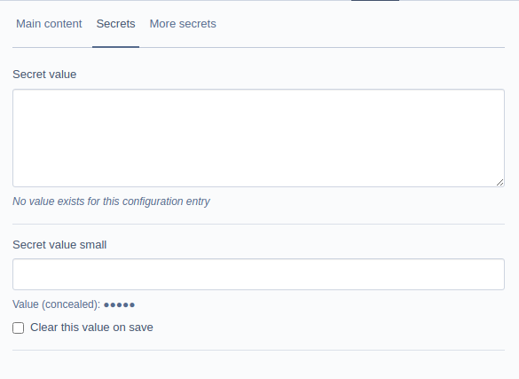

# One-time field value saving for Silverstripe

A Silverstripe module for storing private string values, optionally encrypted.

To update the value, add the plain text secret to the relevant field and save the record, the old value will be overwritten.

The stored value can be cleared using the supplied checkbox.

## Installing 

The only supported method of installing this module is via composer:

```shell
composer require codem/silverstripe-onetime
```

## Requirements

[Per composer.json](./composer.json)

## Configuration

## Partial field value display

Use the following configuration values with your project config to manage partial value display in supporting fields

```yaml
---
Name: app-onetime
After:
  - '#onetime'
---
Codem\OneTime\PartialValue:
  min_characters_replaced : 6
  max_characters_replaced : 18
  percent_cleared : 80
  replacement_character: '*'
```

## Extension

In your site/module .yml configuration, assign the `HasSecrets` extension to the relevant DataObjects. Once applied and flushed, these dataobjects will be able to access the methods for encryption/decryption provided by the extension.

```yaml
MyOrg\MyDataObject:
  extensions:
    - 'Codem\OneTime\HasSecrets'
MyOrg\AnotherDataObject:
  extensions:
    - 'Codem\OneTime\HasSecrets'
```

In the relevant DataObjects, set up a configuration schema to mark certain fields as being handled by the module:

```php
<?php

namespace MyOrg;

use Codem\OneTime\PartialValue;
use SilverStripe\ORM\DataObject;
//...

class MyDataObject extends DataObject {

    /**
     * Example schema for 3 fields
     */
    private static $onetime_field_schema = [
        'SecretValue' => [
            'provider' => 'Local',
            'partial' => true, // default partial value view
            'tab' => 'Secrets' // on this CMS tab
        ],
        'SecretValueSmall' => [
            'provider' => 'Local',
            'partial' => true, // default partial value view
            'tab' => 'Secrets' // on this CMS tab
        ],
        'SecretValueNoPartial' => [
            'provider' => 'Local',
            'partial' => false, // default partial value view
            'tab' => 'MoreSecrets' // on a different CMS tab
        ]
    ];

    private static $db = [
        // other fields
        // ...
        'SecretValue' => 'Text',// a Textarea - no partial display for these even if partial is true
        'SecretValueSmall' => 'Varchar',// a TextField
        'SecretValueNoPartial' => 'Varchar'//  a TextField with no partial value displayed
    ];

    // etc
}

```

The above config will look something like this. The 2nd field has a value saved.



## Providers

There are two providers currently supported

### Local

The values are stored in the local database in plain text but are not displayed in the relevant fields.

> :warning: This provider *only* helps to avoid users with certain CMS/Admin seeing secret values.

### AmazonKMS
The values are stored encrypted in the local database and are not shown in the relevant fields. Encryption and decryption is handled via the AWS client.

You can use the decrypted values in your application, for instance submitting a consumer secret to an API.

#### Configuration
 
AmazonKMS requires an AWS Key, Secret Key, Key ID and AWS Region value to be available, add them to your site's configuration YML like so:

```yaml
Codem\OneTime\Provider\AmazonKMS:
  access_key: 'access_key'
  secret: 'secret'
  aws_region: 'an-aws-region'
  key_id: 'a-kms-keyid'
```

**OR**

You may also not provide the access_key & secret and instead rely on other authentication methods provided by AWS (e.g ~/.aws/credentials)

The IAM user with the relevant access_key and secret must have encrypt/decrypt privileges set up. You should not use your AWS root/admin user for this.

#### Encryption Context

Encryption Context is optional and assists with logging of encrypt/decrypt requests.

If you want to use this option, add it to the above configuration like so or in your environment:

```yaml
Codem\OneTime\Provider\AmazonKMS:
  access_key: 'access_key'
  secret: 'secret'
  aws_region: 'an-aws-region'
  key_id: 'a-kms-keyid'
  encryption_context:
    AContextKey: 'some_context_value'
```

Read [Encryption Context documentation](https://docs.aws.amazon.com/kms/latest/developerguide/encryption-context.html) at AWS for more information.

## Decrypting
When you wish to get the field value back, simply call `decrypt()` on your DataObject. The argument is the field name.

```php
$instance = MyDataObject::get()->byId(1);
$plaintext = $instance->decrypt('SomeFieldNameWithEncryptedValue');
```
You can then use that value in your application, e.g by passing it to an API.

### Good-to-know

### Visibility of secrets on entry

+ Values you enter will be visible when entered into the field
+ If your admin/website is not hosted over an HTTPS connection (!) data will be visible in transit

### Field value truncation

Encrypted values will be longer than the plain text version entered into the field.

If your field is set as a Varchar field, you may experience truncation of the encrypted value when the database insert occurs. Rather than this module automatically changing your field types, it's highly recommended that you specify "Text" as the field type for the relevant fields.

You can then use a ```TextField``` instead of a ```TextareaField``` in your DataObject's getCmsFields, if required.

## LICENSE

BSD-3-Clause

## Maintainers

Codem
